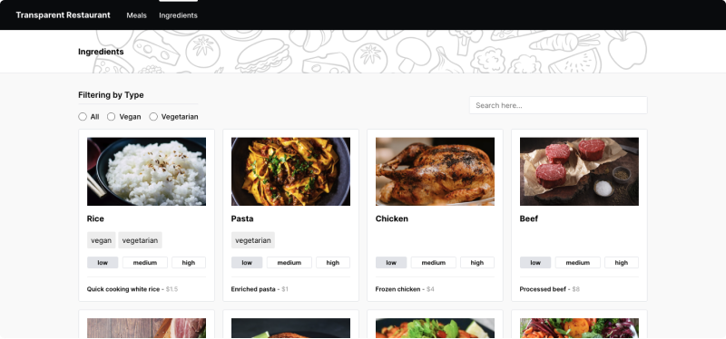

## Digital Menu Restaurant - Nextjs Web Uygulaması

## Başlatma
Cmd tarafında projeye giriş yapılır ve sırasıyla aşağıdaki adımları yapılır.

```bash
npm install
npm run dev
```

Paket kurulumları yapıldıktan sonra **npm run dev** ile projeyi açınız, http://localhost:3000 üzerinden projeye giriş yapabilirsiniz.

## Hakkında
- Restorant için hoşgeldiniz sayfası(Welcome page).


- Meals sayfası


- Meal içerik sayfası


- Ingredients sayfası




## Folder Structure İçeriği

Projenin kaynak kodlarını içeren **src** klasörü altında, alt klasörler oluşturdum. Bu klasörler, uygulamanın farklı kısımlarında kullanılan bileşenler, şablonlar, sabitler, yardımcı fonksiyonlar, test verileri ve API çağrıları gibi farklı fonksiyonellikleri içerir.

#### İçerisindeki klasörleri sırasıyla açıklamam gerekirse;
- **Assets:** İconları içeriyor.
- **Components:** Uygulamanın farklı kısımlarında tekrar kullanılabilecek bileşenleri içeriyor.
- **Composite:** Nested componentleri içeriyor.
- **Constant:** Sabit değişkenleri içeriyor.
- **Helpers:** Yardımcı fonksiyonları içeriyor.
- **Hooks:** Hookları içeriyor.
- **Layouts:** İçerik şablonları içeriyor.
- **Mock:** Test amaçlı kullanabileceği geçici verileri içeriyor.
- **Services:** API çağrılarını içeriyor.
- **Stores:** Veri yönetimini içeriyor.

#### Projede önemli kütüphaneler ve kullandığım teknolojiler;
- nextjs, react, lodash, eslint, axios, mobx, postcss, prettier, sass, turbo, typescript
